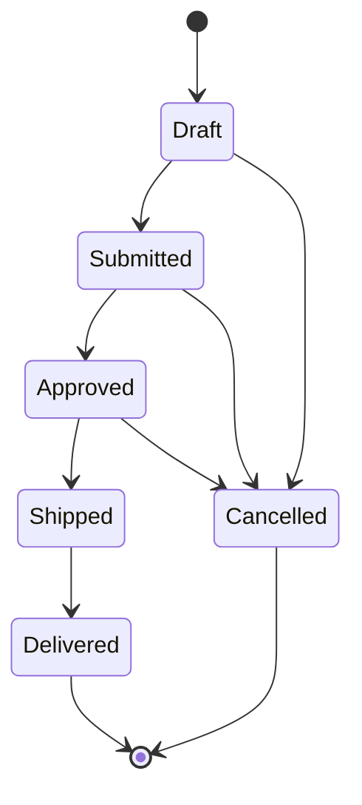

# /data-migration — Data Evolution & Migration Strategy

> Handles all aspects of data evolution: database migrations, backwards-compatible schema changes, event sourcing/CQRS patterns for complex domains, and state machine validation.

---

## Workflow (7 Phases)

### Phase 1 — Context Analysis
> **Emit:** `▶ [1/7] Context Analysis`

Detect the persistence stack and understand schema complexity before proposing any strategy.

- Identify ORM/migration tool in use: Prisma, TypeORM, Sequelize, ActiveRecord, Alembic, Flyway, Liquibase
- Read existing migration files (if any) to understand current schema shape and naming conventions
- Identify database engine: PostgreSQL, MySQL, SQLite, MongoDB, etc.
- Understand schema complexity: number of tables/collections, foreign key constraints, indexes, partitioning
- Validate that `src/domain/` has zero knowledge of migration logic (hexagonal constraint)
- Note the scope argument provided by the user: `migration`, `schema-change`, `cqrs`, or `state-machine`

### Phase 2 — Migration Strategy
> **Emit:** `▶ [2/7] Migration Strategy`

Based on the scope argument, choose and explain the appropriate strategy.

**For scope `migration`** — generate a new migration file with:
- `up` script: forwards change
- `down` script: rollback to previous state
- Idempotent guards where supported (e.g. `IF NOT EXISTS`, `IF EXISTS`)
- Zero-downtime strategy: add columns as nullable first, populate data, then apply NOT NULL constraint in a separate migration
- Rollback procedure with exact commands

**For scope `schema-change`** — backwards-compatible schema evolution using expand-contract:
1. **Expand**: add the new column/table/field (old code ignores it)
2. **Contract (migrate data)**: backfill data from old shape to new shape
3. **Clean up**: remove the old column/table/field in a separate deploy after all code uses the new shape
- When to use database views as compatibility shims during the transition window

**For both scopes** — confirm that domain layer (`src/domain/`) has zero migration coupling.

### Phase 3 — Zero-Downtime Patterns
> **Emit:** `▶ [3/7] Zero-Downtime Patterns`

For any migration touching a production database, apply these constraints explicitly:

- **Never drop a column in the same deploy as removing code that uses it** — three-deploy minimum for column removal
- **Adding indexes**: use `CREATE INDEX CONCURRENTLY` on PostgreSQL to avoid table locks; document equivalent for other engines
- **Renaming a column or table**: always follow the three-deploy cycle:
  1. Deploy 1: add the new name, write to both old and new
  2. Deploy 2: read from new, stop writing to old
  3. Deploy 3: remove old name
- **Large table backfills**: batch updates with a configurable batch size and sleep between batches to avoid long-running locks

```sql
-- Example: backfill in batches (PostgreSQL)
DO $$
DECLARE
  batch_size INT := 1000;
  last_id    BIGINT := 0;
BEGIN
  LOOP
    UPDATE orders
    SET    status_v2 = status
    WHERE  id > last_id
      AND  id <= last_id + batch_size
      AND  status_v2 IS NULL;

    EXIT WHEN NOT FOUND;
    last_id := last_id + batch_size;
    PERFORM pg_sleep(0.1);
  END LOOP;
END $$;
```

### Phase 4 — Event Sourcing / CQRS
> **Emit:** `▶ [4/7] Event Sourcing / CQRS`

Only applicable when scope is `cqrs`. Otherwise skip and emit `▶ [4/7] Event Sourcing / CQRS — skipped (scope: [scope])`.

**When to use CQRS over CRUD:**
- Audit trail is a hard requirement (regulatory compliance, financial ledgers)
- Complex temporal queries (what was the state of X at time T?)
- Collaborative real-time features (conflict resolution needed)
- Domain has high read/write asymmetry requiring separate scaling

**Event Store design:**
- Append-only `domain_events` table: `id`, `aggregate_id`, `aggregate_type`, `event_type`, `payload` (JSON), `occurred_at`, `version`
- Aggregate snapshots table (optional, for long event streams): `aggregate_id`, `aggregate_type`, `snapshot_payload`, `version`, `created_at`
- No updates, no deletes — events are immutable

**Read model projections:**
- Each read model is a separate table/view optimized for a query pattern
- Projections are infrastructure adapters that consume domain events and write to read model tables
- Place projection handlers in `src/infrastructure/projections/`

**CQRS split in hexagonal architecture:**
- Command handlers: `src/application/commands/` — orchestrate domain logic, emit domain events
- Query handlers: `src/application/queries/` — read from projected read models only, never from aggregate state
- Projections: `src/infrastructure/projections/` — subscribe to events, update read models

**Replay strategy:**
- Rebuilding a read model: truncate the read model table, replay all events from the event store in order
- Provide a CLI command or admin endpoint for triggering replay

### Phase 5 — State Machine Validation
> **Emit:** `▶ [5/7] State Machine Validation`

Only applicable when scope is `state-machine`. Otherwise skip and emit `▶ [5/7] State Machine Validation — skipped (scope: [scope])`.

**State and transition design — domain layer only (zero external deps):**

```typescript
// src/domain/order/OrderStatus.ts
export type OrderStatus =
  | 'Draft'
  | 'Submitted'
  | 'Approved'
  | 'Shipped'
  | 'Delivered'
  | 'Cancelled';

const VALID_TRANSITIONS: Record<OrderStatus, OrderStatus[]> = {
  Draft:     ['Submitted', 'Cancelled'],
  Submitted: ['Approved', 'Cancelled'],
  Approved:  ['Shipped', 'Cancelled'],
  Shipped:   ['Delivered'],
  Delivered: [],
  Cancelled: [],
};

export function transition(from: OrderStatus, to: OrderStatus): OrderStatus {
  const allowed = VALID_TRANSITIONS[from];
  if (!allowed.includes(to)) {
    throw new Error(`Invalid transition: ${from} → ${to}`);
  }
  return to;
}
```

**State diagram (Mermaid) — generate for the actual domain:**



**Test strategy:**
- Test every valid transition: `transition('Draft', 'Submitted')` → does not throw
- Test every invalid transition: `transition('Delivered', 'Cancelled')` → throws with descriptive message
- Test terminal states have no outgoing transitions

### Phase 6 — Testing Data Migrations
> **Emit:** `▶ [6/7] Testing Data Migrations`

Three-tier testing strategy for migrations:

**Unit test — each migration in isolation:**
- Test `up()` applies the schema change correctly
- Test `down()` reverts cleanly
- Verify idempotency: running `up()` twice does not error

**Integration test — against a real (containerized) database:**
- Spin up a clean database container
- Apply all migrations up to the one under test
- Verify data integrity after `up()`: constraints present, indexes exist, data populated
- Apply `down()`, verify schema matches pre-migration state

**Production-like test — volume and duration:**
- Seed with realistic data volume (matches production row counts)
- Measure migration duration: document expected runtime
- Verify no table locks that would block reads during migration

Test location: `tests/integration/migrations/[migration-name].test.ts`

### Phase 7 — Migration Runbook
> **Emit:** `▶ [7/7] Migration Runbook`

Generate `docs/migrations/RUNBOOK.md` with the following sections:

```markdown
# Migration Runbook

## Running Migrations

### Local
[stack-specific command, e.g. `rtk npx prisma migrate dev`]

### Staging
[command + environment variable requirements]

### Production
[command + pre-flight checklist: backup taken, maintenance window, rollback plan confirmed]

## Checking Migration Status
[stack-specific status command]

## Rolling Back
[down command + manual steps if automatic rollback is not supported]

## Emergency Procedures

### Migration fails mid-run
1. Assess: is the database in a partially migrated state?
2. If partial: manually apply rollback SQL (see migration `down` script)
3. Restore from backup if data corruption occurred
4. Alert on-call: [contact]
5. Post-mortem: add a test to catch the failure scenario before re-attempting

## Migration History
[table of applied migrations, auto-generated by ORM]
```

---

## Quick Reference

```bash
# Prisma
rtk npx prisma migrate dev --name [migration-name]
rtk npx prisma migrate status
rtk npx prisma migrate reset   # dev only — wipes DB

# TypeORM
rtk npx typeorm migration:generate -n [MigrationName]
rtk npx typeorm migration:run
rtk npx typeorm migration:revert

# Alembic (Python)
rtk alembic revision --autogenerate -m "[description]"
rtk alembic upgrade head
rtk alembic downgrade -1

# Flyway
rtk flyway migrate
rtk flyway info
rtk flyway repair
```

---

## Deviating from this workflow

- Skip Phase 4 (CQRS) unless scope is explicitly `cqrs`
- Skip Phase 5 (State Machine) unless scope is explicitly `state-machine`
- Never skip Phase 3 (Zero-Downtime Patterns) for migrations on production databases
- Never skip Phase 7 (Runbook) — it is the artifact that keeps operations safe
